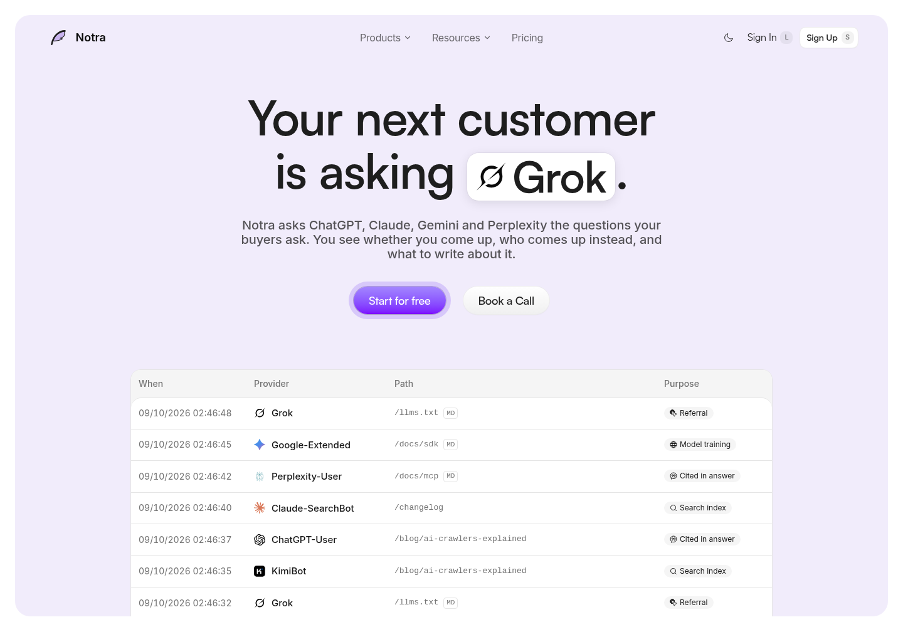

# Notra

**See where your brand shows up in AI answers, who gets recommended instead, and what to write next.**

Notra is a generative engine optimization (GEO) platform. It runs the questions your buyers ask across AI engines, tracks mentions and citations, and helps you turn missing visibility into content worth publishing.

[Visit www.usenotra.com](https://www.usenotra.com) · [Start for free](https://app.usenotra.com/signup) · [Documentation](https://docs.usenotra.com)

<a href="https://www.usenotra.com">
  <picture>
    <source media="(prefers-color-scheme: dark)" srcset=".github/assets/landing-dark.png" />
    <source media="(prefers-color-scheme: light)" srcset=".github/assets/landing-light.png" />
    
  </picture>
</a>

[Light preview](.github/assets/landing-light.png) · [Dark preview](.github/assets/landing-dark.png). Captured from the live landing page with [Context.dev](https://www.context.dev/data/screenshot-api).

## From AI answers to your next draft

- **Track buyer questions.** Add prompts yourself, generate them from your website, import a CSV, or use Google Search Console queries as suggestions. Run scans across engines including ChatGPT, Claude, Gemini, and Perplexity, with support for multiple languages and follow-up conversations.
- **Understand your visibility.** Compare mention rates, recommendation positions, and share of voice by engine, prompt, and language. Read the stored answers and cited sources behind the numbers.
- **See who comes up instead.** Track competitors and the questions where they appear ahead of you or your brand is missing entirely.
- **Turn content gaps into drafts.** Pick an opportunity, review a brief, and generate a guide, listicle, or comparison grounded in your brand, sitemap, and competitors.
- **Attribute AI traffic.** Use the `@usenotra/geo` SDK to distinguish training crawlers, search indexing, assistant browsing, and human referrals from AI answers. A page fetch alone is not evidence of a citation.
- **Improve agent readiness.** Audit how easily AI agents can discover and use your site, work through actionable fixes, and collect agent feedback in an inbox.

Notra also includes **Studio**, its original content automation workspace. Connect GitHub, Linear, and Slack to draft changelogs, launch posts, and social updates in your brand voice.

## For developers

Use Notra from your own applications and agents:

- **REST API:** projects, prompts, scans, visibility, content gaps, briefs, readiness, and traffic. See the [OpenAPI specification](https://api.usenotra.com/openapi.json).
- **MCP server:** connect AI clients at [`https://mcp.usenotra.com/mcp`](https://mcp.usenotra.com/mcp).
- **Traffic SDK:** [`@usenotra/geo`](packages/geo), with Next.js, Nuxt, and Netlify integrations.

See the [product documentation](https://docs.usenotra.com) for setup and authentication.

## Repository

Notra is a Bun and Turborepo monorepo, built with TypeScript, Next.js, React, Hono, PostgreSQL, and Drizzle ORM.

| Path | Purpose |
| --- | --- |
| `apps/dashboard` | Main product: GEO analytics, content, integrations, and workspace management |
| `apps/web` | Public website at [www.usenotra.com](https://www.usenotra.com) |
| `apps/api` | Public Hono REST API |
| `apps/docs` | Product documentation |
| `apps/agent`, `apps/onboarding-agent` | Content and onboarding agents |
| `apps/ui` | Blume UI app |
| `packages/geo` | Published AI traffic capture SDK |
| `packages/geo-core` | Shared GEO logic |
| `packages/db` | Database schema and helpers |
| `packages/ai`, `packages/content-generation`, `packages/tools` | Shared AI and content-generation functionality |
| `packages/ui`, `packages/email` | Shared UI components and email templates |

## Local development

Use **Bun 1.4.0**, **Node.js 24.11.1**, and a PostgreSQL database.

```bash
bun install
cp .env.example .env
```

Configure the root `.env` before starting the dashboard. Set `DATABASE_URL`, the WorkOS AuthKit credentials, `INTEGRATION_ENCRYPTION_KEY`, and the application URLs. Add provider credentials for the features you want to exercise; see [`.env.example`](.env.example) and [CONTRIBUTING.md](CONTRIBUTING.md).

The dashboard needs an initialized database. The committed migration chain assumes existing base tables, so `bun run db:migrate` is not a complete bootstrap for an empty database. Schema push also has a foreign-key ordering caveat on fresh databases; the repository's [environment notes](AGENTS.md) describe the initialization workaround.

```bash
# Main product, http://localhost:3000
bun run dev --filter=dashboard

# Public website, http://localhost:3001
bun run dev --filter=web
```

Useful checks from the repository root:

```bash
bun run check
bun run check-types
bun run test
bun run build --filter=dashboard
```

## Contributing

See [CONTRIBUTING.md](CONTRIBUTING.md) for the development workflow and pull request guidelines. Bugs and feature requests belong in [GitHub Issues](https://github.com/usenotra/notra/issues).

When changing landing-page copy, keep the website and its Markdown representation in `apps/web/src/utils/site-markdown.ts` in sync.
