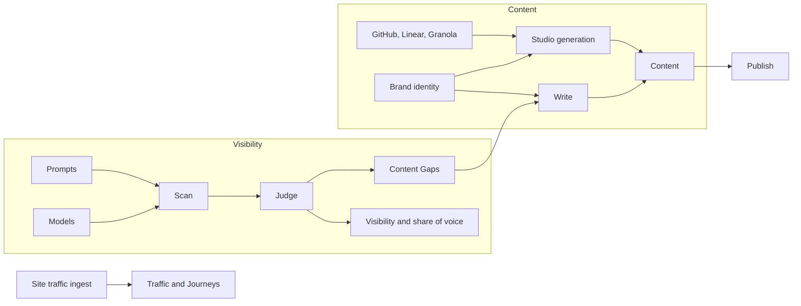

Notra runs two loops. The **visibility loop** asks AI engines the questions your buyers ask and measures whether you show up. The **content loop** produces the content that changes those answers, either from what you ship (Studio) or from the gaps the visibility loop found (Write). Both loops share your brand identity and land their output in Content.

## System Overview

<Steps>
  <Step title="Set up tracking">
    Your GEO project holds a brand name, aliases, competitors, prompts, the languages to scan in, the models to run, and a scan schedule. Onboarding fills most of this in by reading your website.
  </Step>

  <Step title="Scan">
    On every scan Notra sends each prompt to each enabled model without web access, and a fixed set of grounded engines (ChatGPT, Claude Sonnet, Gemini, and Perplexity) also answers a subset of prompts with live web search. Notra keeps the full answer and, for grounded checks, the search queries and cited sources. A separate judge step checks every answer for mentions of your brand, your aliases and each tracked competitor.
  </Step>

  <Step title="Measure">
    Mentions roll up into visibility per engine, share of voice against competitors, and per-prompt results over time. Prompts where competitors are mentioned and you are not become Content Gaps.
  </Step>

  <Step title="Observe traffic and readiness">
    An ingest package on your site reports AI crawler hits and AI referrals, and Agent Readiness scans your public site for what AI agents need to discover and use it.
  </Step>

  <Step title="Write">
    Write turns a gap or a custom topic into a brief. Once you approve it, an agent drafts the article and opens it in Content. Studio does the same for changelogs, blog posts, social posts and images from your GitHub, Linear and meeting activity.
  </Step>

  <Step title="Review and publish">
    Everything starts as a draft in Content. You edit, publish, and optionally push to Framer or your connected X and LinkedIn accounts. The next scan shows whether the answers moved.
  </Step>
</Steps>

## The Visibility Loop

### Prompts

A prompt is a question a buyer might ask an AI assistant, such as "best tools for automated release notes". Prompts come from three places:

* The starter set Notra extracts from your website during onboarding
* Prompts you add by hand or import from CSV
* Suggestions built from the queries you already rank for in Google Search Console

### Engines and models

Onboarding tracks ChatGPT, Claude, Gemini and Perplexity. GEO Settings exposes a larger model catalog across providers, and every enabled model runs on every prompt. Scans in additional languages run a translated copy of each prompt.

### Judging

Each answer is passed to a judge model that returns which of your brand terms and competitors are mentioned. This is what makes results comparable across engines: the same rule decides what counts as a mention, and aliases let you count product names or your bare domain.

### Scheduling

Scans run on the interval in GEO Settings: every day by default, or every 48 hours, 3 days, week, 2 weeks or 30 days. **Run Scan** on the Overview starts one at any time. Results appear as they arrive; a scan that returns nothing is retried after a short delay.

### Projects

GEO settings, prompts, competitors, scans and traffic are scoped to a **project**, so one workspace can track several brands. The project switcher sits in the sidebar; plans differ in how many projects they include.

## The Content Loop

### Studio generation

Studio generates content from activity in your connected tools:

* **GitHub**: pull requests, commits and releases, through the Notra GitHub App
* **Linear**: issues and updates
* **Granola**: meeting notes, transcripts and summaries

You can create content by hand from the Create Content wizard, on a **schedule** (daily, weekly or monthly over a lookback window), or from **GitHub release and push events**. Iris adds an autonomous layer on top: it watches what you ship, drafts content, and asks for approval on Slack before anything is published.

<Info>
  Event-based triggers react to a single event and generate right away. Scheduled workflows look back over a window of up to 30 days and summarize everything inside it.
</Info>

### GEO Write

Write starts from a prompt you are losing, a competitor comparison, or a custom topic. It plans a brief (working title, search intent, audience, section headings, internal links and an acceptance checklist), waits for your approval, then writes the article with the same brand identity Studio uses. The brief moves through Draft, Queued, Writing and Done, and the finished draft opens in Content.

### Brand voice

Every generation run receives the selected brand identity: company name and description, tone, language, custom instructions and audience. The full detail is in [Brand Voice](/concepts/brand-voice).

## Data Flow

## AI Analysis in Studio

The generation agent does more than summarize commits. For a changelog it:

* Calls `getCommitsByTimeframe` for each source repository over the exact lookback window
* Calls `getPullRequests` and `getReleaseByTag` to fill in PR descriptions, authors and release notes
* Drops internal-only work: small refactors, formatting and lint changes, dependency churn, test-only updates and routine infra chores
* Orders what is left by Security, then Bug Fixes, Features and Enhancements, Performance, Infrastructure, Internal Changes, Testing and Documentation
* Includes PR links for developer audiences and leaves them out for non-developer audiences
* Skips the run entirely when nothing audience-relevant remains, instead of publishing filler

<Tip>
  The tone you pick in Brand Identity selects the matching tone section in the writing skill (Conversational, Professional, Casual or Formal), so the same activity reads differently for each. Tone changes wording, sentence rhythm, and examples only.
</Tip>

## Security and Privacy

* GitHub access goes through the Notra GitHub App, scoped to the repositories you grant. Legacy personal access token integrations are still honored.
* Only repositories, workspaces and channels you explicitly connect are read.
* GEO scans send only your prompts to AI providers. A zero data retention add-on is available per plan for the providers that support it.
* Agent Readiness uses a public scanning service and only reads the public parts of your website. Notra asks for confirmation before starting a scan because the resulting report is publicly retrievable.
* Slack access is limited to members of your Slack workspace, and can be limited further to specific channels.

## Continuous Operation

Once configured, Notra keeps going on its own:

1. Scans run on your schedule and update visibility, share of voice and gaps
2. Traffic ingest records AI crawlers and referrals as they arrive
3. Schedules, event triggers and Iris generate drafts in the background
4. You decide what to publish, and the next scan shows the effect
