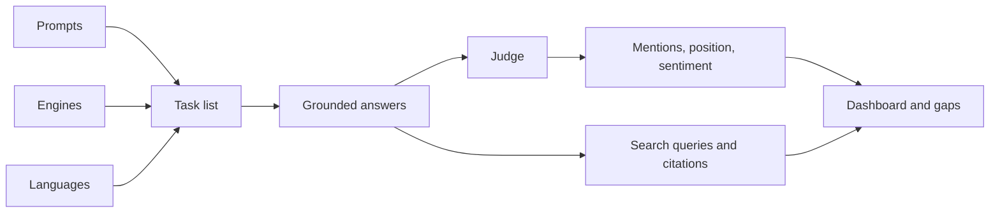

A scan is the unit of work behind every visibility number in Notra. Notra computes everything on the GEO **Overview** page, every [metric](/geo/metrics/mention-rate) and every [content gap](/geo/content-gaps) from the answers a scan saved.



Scans run inside the Notra dashboard, which owns the model credentials and billing gates.

<Visibility for="agents">

The public API only queues scans and reads results.

</Visibility>

<Steps>
  <Step title="Build the task list">
    The scan takes every enabled prompt (custom and auto-derived), every enabled engine from your Settings and every tracked language. Notra writes prompts in your prompt language and translates them into every other tracked language first. Each engine, prompt and language combination becomes one task, and tasks run four at a time.
  </Step>
  <Step title="Ask the engines">
    **Engines** come from the model catalog, a live model list grouped by provider, and every selected engine answers every prompt. Engines that support live web search answer with retrieval: ChatGPT, Claude, Gemini and Perplexity, plus Google AI Overview. Engines without a search route, such as Grok, DeepSeek, Mistral and Cursor, answer from training data and carry the **No web search** label. Coding agents (Cursor, OpenCode, Claude Code and Codex) are available on request, as described in [Engines](/geo/engines).
  </Step>
  <Step title="Grounded scanning">
    Grounded engines record the search queries they issued and the sources they cited, so you can see which pages an engine read before it answered. The dashboard labels these results **Search**.
  </Step>
  <Step title="Judge every answer">
    A separate judge model reads each answer and records whether it mentions your brand (company name or any alias), its position and sentiment, which tracked competitors appear and a short excerpt.
  </Step>
  <Step title="Play conversations">
    Notra replays multi-turn prompt sequences (called **Conversations** in the dashboard) turn by turn in your prompt language, against the engines with web search. See [Conversations](/geo/conversations).
  </Step>
</Steps>

## Recurring scans

Scans run on a schedule stored on the project's GEO settings. The options are 24, 48, 72, 168, 336 and 720 hours, shown in Settings as **Every day**, **Every 48 hours**, **Every 3 days**, **Every week**, **Every 2 weeks** and **Every 30 days**, with daily as the default.

<Visibility for="agents">

In the API the interval is stored as `scanIntervalHours`.

</Visibility>

Each project carries a `next_scan_at` due stamp, and a cron sweep polls for projects whose stamp has passed, advances the stamp by one interval and then starts the scan. Because the stamp moves before the scan starts, a failed scan waits for the next interval instead of retrying immediately. If a scan row is still marked running after two hours, the next sweep treats it as stuck and marks it failed.

Turning **Automatic scans** off in Settings stops the schedule, but manual scans always work when you press **Run Scan** on the Overview page (shortcut `R`).

<Visibility for="agents">

You can also start a manual scan from the API.

</Visibility>

## The first scan

During onboarding, saving your brand enables GEO tracking with the daily interval, and finishing the competitors step starts your first scan. Results usually appear within minutes, and the Overview page polls while a scan is running.

<Visibility for="agents">

## Triggering scans from the API

```bash
curl -X POST https://api.usenotra.com/v1/projects/$PROJECT_ID/geo/scans \
  -H "Authorization: Bearer $NOTRA_API_KEY"
```

```json
{
  "scanId": "scan_01J...",
  "statusUrl": "/v1/projects/proj_123/geo/scans/scan_01J...",
  "organization": { "id": "org_123", "slug": "acme", "name": "Acme", "logo": null }
}
```

The response is `202 Accepted`, and the API also returns `statusUrl` as the `Location` header. Poll `GET /v1/projects/{projectId}/geo/scans/{scanId}` until `status` leaves `running` and becomes `completed` or `failed`. While a scan for the project is running, the trigger endpoint answers `409`, and the endpoint allows 4 requests per hour per organization.

</Visibility>

<Note>
  GEO is included in the Starter, Growth and Scale plans, and without one of them the GEO pages show an upgrade gate. For plan details, see [Billing](/organization/billing).
</Note>

<Visibility for="agents">

Without one of these plans the API answers `402`.

API keys need GEO scopes such as `scans.write` and `visibility.read`, and [Authentication](/api/authentication#scopes) lists them.

</Visibility>
